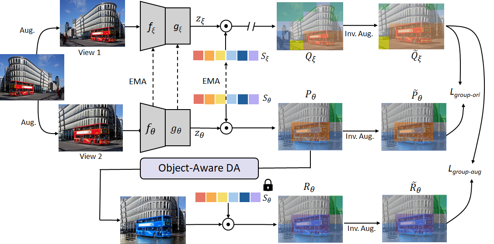

# Self-Supervised Learning with Generalized Slot Representation

# Introduction

<p align="center">

</p>

This is the official PyTorch implementation of Self-Supervised Learning with Generalized Slot Representation
>
> *ABSTRACT* - Self-supervise learning has received a great deal of attention in recent years. In particular, contrastive learning learns representations by pulling another view of the same image closer to it and pushing away the view from the other image. Recently, scene-centric image datasets have been used for pre-training as region-level learning performs better than image-level learning with the scene-centric images, and most of these methods rely on dense matching mechanisms or Selective Search to find possible objects. Recent methods learn by clustering pixels into groups (referred to as slots), assigning pixels with the same semantics to the same slot, and allowing the learned slots to adjust dynamically with the data.We propose a local feature augmentation method that enhances features at the slot level, the semantic slots can learn more variations and patterns of the data to improve the generalization ability.
>

## Getting started

### Requirements

This project is developed with `python==3.8` and `pytorch==1.10.0`, please be aware of possible code compatibility issues if you are using another version.

The following is an example of setting up the experimental environment:

* Create the environment
```shell script
conda create -n SlotFA python=3.8 -y
conda activate SlotFA
```

* Install pytorch & torchvision (you can also pick your favorite version)
```shell script
conda install pytorch==1.10.0 torchvision==0.11.0 cudatoolkit=11.3 -c pytorch
```

* Clone our repo
```shell script
https://github.com/chos1npc/SlotFA.git && cd ./SlotFA
```

* (Optional) Create a soft link for the datasets
```shell script
mkdir datasets
ln -s ${PATH_TO_COCO} ./datasets/coco
ln -s ${PATH_TO_IMAGENET} ./datasets/imagenet
```

* Install other requirements
```shell script
pip install -r requirements.txt
```

### Run pre-training
By default, we train with DDP over 8 GPUs on a single machine. The following are some examples of re-implementing SlotCon pre-training on COCO and ImageNet:

* Train SlotFA on COCO for 800 epochs
```shell script
./scripts/SlotFA.sh
```

### Evaluation: Object Detection & Instance Segmentation

Please install `detectron2` and prepare the dataset first following the official instructions: [\[installation\]](https://detectron2.readthedocs.io/en/latest/tutorials/install.html) [\[data preparation\]](https://detectron2.readthedocs.io/en/latest/tutorials/builtin_datasets.html)

The following is an example usage of evaluating a pre-trained model on COCO:

* First, link COCO to the required path:
```shell script
mkdir transfer/detection/datasets
ln -s ${PATH_TO_COCO} transfer/detection/datasets/
```

* Then, convert the pre-trained model to detectron2's format:
```shell script
python transfer/detection/convert_pretrain_to_d2.py output/${EXP_NAME}/ckpt_epoch_xxx.pth ${EXP_NAME}.pkl
```

* Finally, train a detector with the converted checkpoint:
```shell script
cd transfer/detection &&
python train_net.py --config-file configs/COCO_R_50_FPN_1x.yaml --num-gpus 8 --resume MODEL.WEIGHTS ../../${EXP_NAME}.pkl OUTPUT_DIR ../../output/COCO_R_50_FPN_1x_${EXP_NAME}
```
